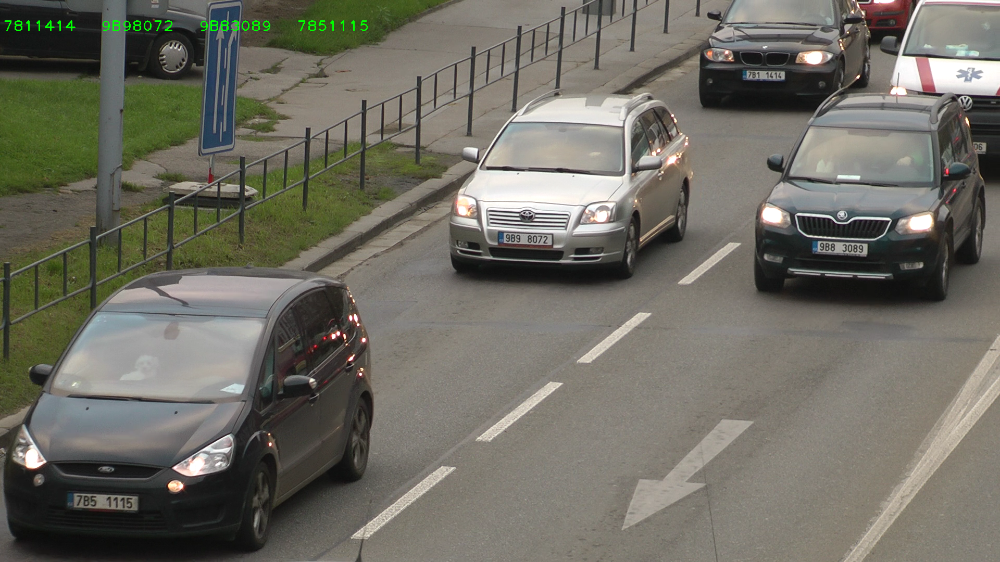
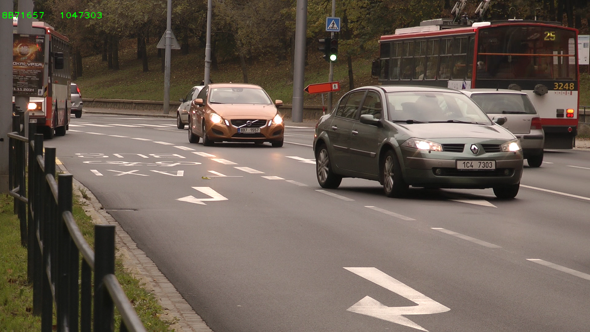
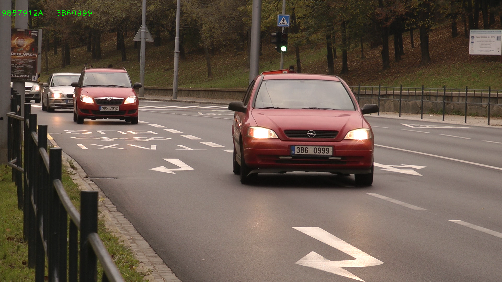
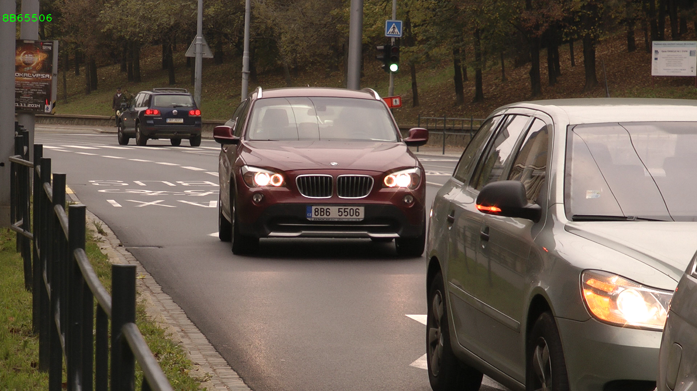
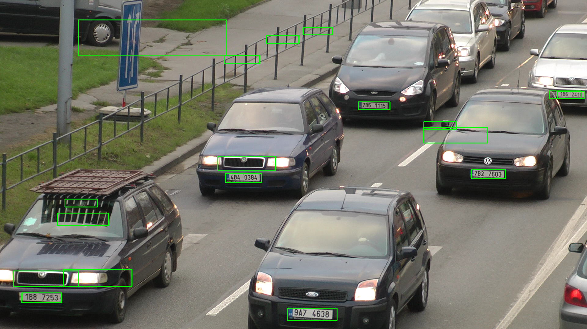

# Automatic number plate recognition

Licence plate recognizer which takes images from [input](recognize/input) folder and saves them in the [output](recognize/output) with number plates written on them. Working on Czech licence plates.

To compile recognizer in [recognize](recognize/) directory you will need OpenCV installed and then make it. Start program with make run.
[prepare_data](prepare_data/) directory contain tools for classifier training and testing.

December 2014

## Authors
* Tereza Cerna - dartemolay@gmail.com
* Klada Vankova - k.skotakova@gmail.com
* Jakub Kvita - kvitajakub@gmail.com

## Gallery

